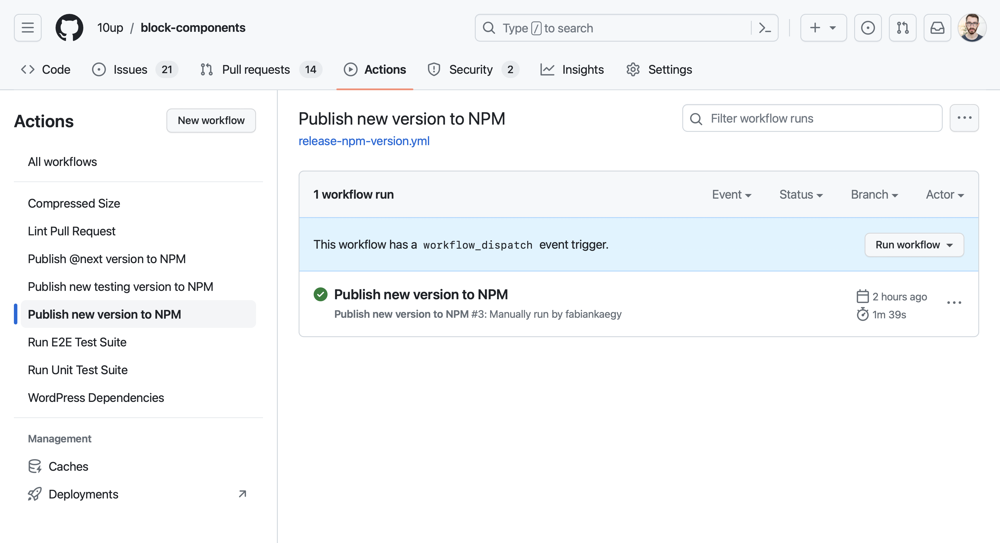
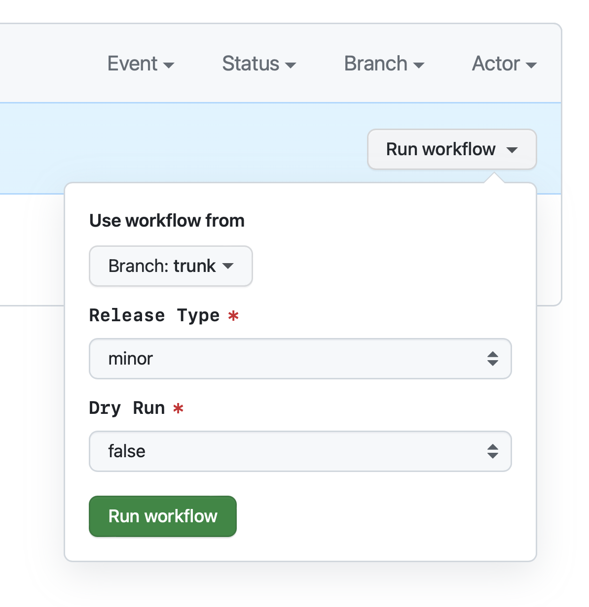

# Contributing and Maintaining

First, thank you for taking the time to contribute!

The following is a set of guidelines for contributors as well as information and instructions around our maintenance process. The two are closely tied together in terms of how we all work together and set expectations, so while you may not need to know everything in here to submit an issue or pull request, it's best to keep them in the same document.

## Ways to contribute

Contributing isn't just writing code - it's anything that improves the project. All contributions for the Block Components are managed right here on GitHub. Here are some ways you can help:

### Reporting bugs

If you're running into an issue with the plugin, please take a look through [existing issues](https://github.com/10up/block-components/issues) and [open a new one](https://github.com/10up/block-components/issues/new) if needed. If you're able, include steps to reproduce, environment information, and screenshots/screencasts as relevant.

### Suggesting enhancements

New features and enhancements are also managed via [issues](https://github.com/10up/block-components/issues).

### Pull requests

Pull requests represent a proposed solution to a specified problem. They should always reference an issue that describes the problem and contains discussion about the problem itself. Discussion on pull requests should be limited to the pull request itself, i.e. code review.

For more on how 10up writes and manages code, check out our [10up Engineering Best Practices](https://10up.github.io/Engineering-Best-Practices/).

## Workflow

The `develop` branch is the development branch which means it contains the next version to be released. `stable` contains the current latest release and `trunk` contains the corresponding stable development version. Always work on the `develop` branch and open up PRs against `develop`.

## Local Environment

This repository contains a local environment setup using the `@wordpress/env` package. Before you can start that environment you will need to run `npm ci` in both the repository root and `example` directory. This will install the required dependencies.

Next, run `npm run build` in both the root and `example` directories to build and compile the needed assets or if you want to watch for changes instead, use `npm run start`.

Lastly, navigate your terminal to the `example` directory and run `npm run wp-env start` to start the local environment. The environment should be available at [http://localhost:8888](http://localhost:8888) and the credentials to login to the admin are: `admin` `password`.

## Working on a new or existing component

To work on a new or an existing component, after running your Local Environment, you can import the component you need from `@10up/block-components`. You can see how this is currently done in the [/example/src/index.js](https://github.com/10up/block-components/blob/trunk/example/src/index.js#L6) file. If you work on a new component inside the `/components/` folder, make sure to expose it's export in the [index.js](https://github.com/10up/block-components/blob/trunk/index.js) file.

The components in the repository do not store data using useAttributes. This is done in the Gutenberg blocks that include the Block Components of this repository. That isn't to say that the block components are not working with data. An example of that is the [ContentSearch](https://github.com/10up/block-components/blob/develop/components/ContentSearch/index.js) component. When you test out a component in the `example/index.js` file, you ideally want to also store the [block attributes](https://developer.wordpress.org/block-editor/reference-guides/block-api/block-attributes/) there.

After you are ready with your changes, make sure to only commit and push the work from the **components folder**, not the example folder, unless, of course, the ticket is for the example folder.

## Release instructions

Releases can get managed entirely via the UI in GitHub. There are various actions in place to make this as seamless as possible.

### Deploying a `@testing` version of a specific PR

Whenever a PR gets created / new changes are pushed to a PR, a GitHub Action runs that will try to deploy a prerelease version tagged with the pr number to NPM.

> **Note**
> This action only runs when it gets approved by a maintainer of the 10up Block Components repository.

### Deploying a `@next` version

Whenever a PR gets merged into the `develop` branch, a GitHub Action runs that will automatically release a new `@next` version of the package.

### Deploying `patch`, `minor`, or `major` versions

Whenever a new `patch`, `minor`, or `major` version of the package should get released, the code first needs to get merged into the `trunk` branch. Once the code is on the `trunk` brach you need to head to the `Actions` tab in the repository and select the [`Publish new version to NPM`](https://github.com/10up/block-components/actions/workflows/release-npm-version.yml) Action in the sidebar.

This Action can be manually triggered and allows you to choose what type of release you want to start.

> **Warning**
> This action will only successfully run when `trunk` gets selected as the Branch. For any other branch it will skip all steps.

> **Note**
> This action only runs when it gets approved by a maintainer of the 10up Block Components repository.
