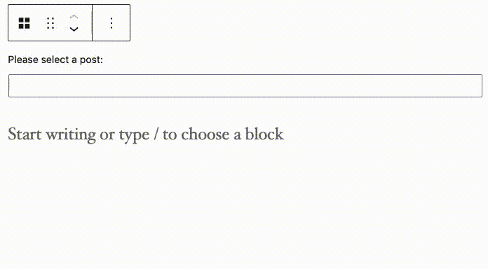

# 10up Block Components

A collection of components built to be used in the block editor. These components do not include any build files and do not bundle the WordPress components. Therefore these need to be used in an environemt where the [`Dependency Extraction Webpack Plugin`](https://www.npmjs.com/package/@wordpress/dependency-extraction-webpack-plugin) is used and the `import { component } from '@wordpress/package';` is supported. If your project is using [10up Scripts](https://github.com/10up/10up-scripts), this is handled automatically.

## Installation

1. Run `npm install --save @10up/block-components` within your WordPress theme or plugin.
2. Within your block editor code, import the relevant component(s) e.g. `import { ContentPicker } from '@10up/block-components';`
3. We highly recommend you use [@10up/scripts](https://github.com/10up/10up-scripts) to build your block files as it handles dependency extraction for you.

## ContentPicker

A Content Picker component that allows you to pick posts and pages very easily.



### Usage

```js
import { ContentPicker } from '@10up/block-components';

function MyComponent( props ) {

    return (
        <ContentPicker
            onPickChange={ (pickedContent) => { console.log(pickedContent) } }
            mode="post"
            label={ "Please select a Post or Page:" }
            contentTypes={ [ 'post', 'page' ] }
        />
    )
}
```

#### Props

| Name             | Type       | Default               | Description                                                            |
| ---------------- | ---------- | --------------------- | ---------------------------------------------------------------------- |
| `onPickChange`   | `function` | `undefined`            | Callback function the list of picked content gets changed |
| `label`          | `string`   | `''`                   | Renders a label for the Search Field.                                  |
| `mode`           | `string`   | `'post'`               | Either `post` or `term`                                 |
| `placeholder`    | `string`   | `''`                   | Renders placeholder text inside the Search Field.                      |
| `contentTypes`      | `array`    | `[ 'post', 'page' ]` | Names of the post types or taxonomies that should get searched                       |
| `maxContentItems`          | `number`   | `1`                   | Max number of items a user can select.
| `isOrderable`          | `bool`   | `false`                   | When true, will allow the user to order items. Must be used in conjunction with `maxContentItems > 1`
| `uniqueContentItems`          | `bool`   | `true`                   | Prevent duplicate items from being picked.
| `excludeCurrentPost`          | `bool`   | `true`                   | Don't allow user to pick the current post. Only applicable on the editor screen.
| `content`          | `array`   | `[]`                   | Array of items to prepopulate picker with. Must be in the format of: `[{id: 1, type: 'post'}, {id: 1, type: 'page'},... ]`. You cannot provide terms and posts to the same picker. Can also take the form `[1, 2, ...]` if only one `contentTypes` is provided.
| `perPage`           | `number`   | `50`               | Number of items to show during search
__NOTE:__ Content picker cannot validate that posts you pass it via `content` prop actually exist. If a post does not exist, it will not render as one of the picked items but will still be passed back as picked items if new items are picked/sorted. Therefore, on save you need to validate that all the picked posts/terms actually exist.

The `contentTypes` will get used in a Rest Request to the `search` endpoint as the `subtypes`:
```js
apiFetch( {
    path: `wp/v2/search/?search="${keyword}"&subtype="${contentTypes.join(',')}"&type=${mode}`
} )...
```
## ContentSearch

A component that lets you search through posts and pages. This component is used by Content Picker. This component provides only the searching functionality and does not maintain any list of chosen items.

### Usage

```js
import { ContentSearch } from '@10up/block-components';

function MyComponent( props ) {

    return (
        <ContentSearch
            onSelectItem={ (item) => { console.log(item) } }
            mode="post"
            label={ "Please select a Post or Page:" }
            contentTypes={ [ 'post', 'page' ] }
        />
    )
}
```

#### Props

| Name             | Type       | Default               | Description                                                            |
| ---------------- | ---------- | --------------------- | ---------------------------------------------------------------------- |
| `onSelectItem`   | `function` | `undefined`            | Function called when a searched item is clicke |
| `label`          | `string`   | `''`                   | Renders a label for the Search Field.                                  |
| `mode`           | `string`   | `'post'`               | Either `post` or `term`                                 |
| `placeholder`    | `string`   | `''`                   | Renders placeholder text inside the Search Field.                      |
| `contentTypes`      | `array`    | `[ 'post', 'page' ]` | Names of the post types or taxonomies that should get searched                       |
| `excludeItems`      | `array`    | `[ { id: 1, type: 'post' ]` | Items to exclude from search |
| `perPage`           | `number`   | `50`               | Number of items to show during search


## useHasSelectedInnerBlock

Determine whether one of the inner blocks currently is selected.

### Usage
```js
import { useHasSelectedInnerBlock } from '@10up/block-components';

function BlockEdit( props ) {
    const hasSelectedInnerBlock = useHasSelectedInnerBlock(props);

    return (
        <div>
            { hasSelectedInnerBlock ? 'InnerBlocks are selected' : 'InnerBlocks are not selected' }
        </div>
    )
}
```
## useRequestData
Custom hook to to make a request using `getEntityRecords` or `getEntityRecord` that provides `data`, `isLoading` and `invalidator` function. The hook determines which selector to use based on the query parameter. If a number is passed, it will use `getEntityRecord` to retrieve a single item. If an object is passed, it will use that as the query for `getEntityRecords` to retrieve multiple pieces of data.

The `invalidator` function, when dispatched, will tell the datastore to invalidate the resolver associated with the request made by getEntityRecords. This will trigger the request to be re-run as if it was being requested for the first time. This is not always needed but is very useful for components that need to update the data after an event. For example, displaying a list of uploaded media after a new item has been uploaded.

Parameters:
* `{string}` entity The entity to retrieve. ie. postType
* `{string}` kind   The entity kind to retrieve. ie. posts
* `{Object|Number}` Optional. Query to pass to the geEntityRecords request. Defaults to an empty object. If a number is passed, it is used as the ID of the entity to retrieve via getEntityRecord.

Returns:
* `{Array}`
    * `{Array} `   Array containing the requested entity kind.
    * `{Boolean}`  Representing if the request is resolving
    * `{Function}` This function will invalidate the resolver and re-run the query.
### Usage

#### Multiple pieces of data.
```js
const ExampleBockEdit = ({ className }) => {
	const [data, isLoading, invalidateRequest ] = useRequestData('postType', 'post', { per_page: 5 });

	if (isLoading) {
		return <h3>Loading...</h3>;
	}
	return (
		<div className={className}>
			<ul>
				{data &&
					data.map(({ title: { rendered: postTitle } }) => {
						return <li>{postTitle}</li>;
					})}
			</ul>
			<button type="button" onClick={invalidateRequest}>
				Refresh list
			</button>
		</div>
	);
};
```
#### Single piece of data
```js
const ExampleBockEdit = ({ className }) => {
	const [data, isLoading, invalidateRequest ] = useRequestData('postType', 'post', 59);

	if (isLoading) {
		return <h3>Loading...</h3>;
	}
	return (
		<div className={className}>

				{data &&( <div>{data.title.rendered}</div>)}

			<button type="button" onClick={invalidateRequest}>
				Refresh list
			</button>
		</div>
	);
};
```
## IsAdmin

A wrapper component that only renders child components if the current user has admin capabilities. The use case for this component is when you have a certain setting that should be restricted to administrators only. For example when you have a block that requires an API token or credentials you might only want Administrators to edit these. See [10up/maps-block-apple](https://github.com/10up/maps-block-apple/blob/774c6509eabb7ac48dcebea551f32ac7ddc5d246/src/Settings/AuthenticationSettings.js) for a real world example.

### Usage
```js
import { IsAdmin } from '@10up/block-components';

function MyComponent( props ) {

    return (
        <IsAdmin
            fallback={ <p>Sorry, you are not allowed to do that</p> }
        >
            <p>Only Administrators can see what you put in here</p>
        </IsAdmin>
    )
}
```

#### Props
| Name       | Type              | Default  |  Description                                                   |
| ---------- | ----------------- | -------- | -------------------------------------------------------------- |
| `fallback` | `ReactElement`    | `null`   | Element that will be rendered if the user is no admin          |
| `children` | `ReactElement(s)` | `'null'` | Child components that will be rendered if the user is an Admin |


## CustomBlockInserter
This component is passed to an `InnerBlocks` instance to as it's `renderAppender` to provide a customized button that opens the Block Inserter.

### Usage
```js
import { CustomBlockAppender } from '@10up/block-components';
const MyComponent = ({clientId}) => {
	<InnerBlocks
		renderAppender={() => (
			<CustomBlockAppender
				className="custom-classname"
				rootClientId={clientId}
				icon="heavy-plus"
				isTertiary
				showTooltip
				label={__('Insert Accordion content', '10up-block-library')}
			/>
		)}
	/>
}
```

#### Props
| Name       | Type              | Default  |  Description                                                   |
| ---------- | ----------------- | -------- | -------------------------------------------------------------- |
| `rootClientId` | `string`    | `''`   | Client it of the block         |
| `buttonText` | `string` | `''` | Text to display in the button |
| `icon` | `string` | `'plus'` | Icon to display.  |
| `..buttonProps` | `object` | `null'` | Any other props passed are spread onto the internal Button component. |

## InnerBlockSlider
This component creates a horizontal slider with inner blocks inside of it.

### Usage
```js
import { InnerBlockSlider } from '@10up/block-components';
const MyComponent = ({clientId}) => {
	<InnerBlockSlider
		allowedBlock="core/cover"
		slidesPerPage={1}
		parentBlockId={clientId}
	/>
}
```

#### Props
| Name       | Type              | Default  |  Description                                                   |
| ---------- | ----------------- | -------- | -------------------------------------------------------------- |
| `allowedBlock` | `string`    | `''`   | Block type to be allowed inside ofthe slider         |
| `slidesPerPage` | `integer` | `1` | Number of slides to show per page |
| `parentBlockId` | `string` | `''` | Client ID of parent block. This is required.  |


## Support Level

**Active:** 10up is actively working on this, and we expect to continue work for the foreseeable future including keeping tested up to the most recent version of WordPress.  Bug reports, feature requests, questions, and pull requests are welcome.

## Like what you see?

<a href="http://10up.com/contact/"></a>
