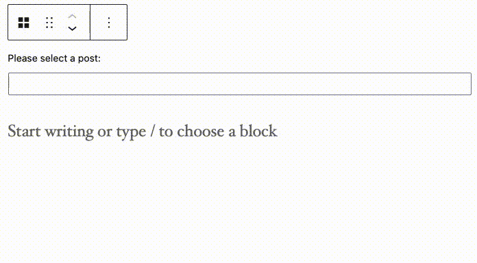

# ContentPicker

A Content Picker component that allows you to pick posts and pages very easily.



## Usage

### Basic Usage

```js
import { ContentPicker } from '@10up/block-components';

function MyComponent( props ) {

    return (
        <ContentPicker
            onPickChange={ (pickedContent) => { console.log(pickedContent) } }
            mode="post"
            label={ "Please select a Post or Page:" }
            contentTypes={ [ 'post', 'page' ] }
        />
    )
}
```

### Customizing Fields and Results

You can customize which fields are fetched from the API, how search results are normalized, and how picked items are displayed using the `queryFieldsFilter`, `searchResultFilter`, and `pickedItemFilter` props:

```js
import { ContentPicker } from '@10up/block-components';
import { useCallback } from '@wordpress/element';

function MyComponent( props ) {
    const queryFieldsFilter = useCallback( (fields, mode) => {
        if ( mode === 'post' ) {
            fields.push('excerpt');
        }
        return fields;
    }, [] );

    const searchResultFilter = useCallback( (item, result) => {
        item.url = '';
        item.info = `<strong>ID:</strong> ${result.id}<br>${result.excerpt}`;
        return item;
    }, [] );

    const pickedItemFilter = useCallback( (item, result) => {
        const info = `<strong>ID:</strong> ${result.id}<br>${result.excerpt.rendered}`;
        return {...item, url: '', info };
    }, [] );

    return (
        <ContentPicker
            onPickChange={ (pickedContent) => { console.log(pickedContent) } }
            mode="post"
            label={ "Please select a Post or Page:" }
            contentTypes={ [ 'post', 'page' ] }
            queryFieldsFilter={queryFieldsFilter}
            searchResultFilter={searchResultFilter}
            pickedItemFilter={pickedItemFilter}
        />
    )
}
```

## Props

| Name                 | Type       | Default              | Description                                                                                                                                                                                                                                                                                                                                                                                                            |
|----------------------|------------|----------------------|------------------------------------------------------------------------------------------------------------------------------------------------------------------------------------------------------------------------------------------------------------------------------------------------------------------------------------------------------------------------------------------------------------------------|
| `onPickChange`        | `function` | `undefined`          | Callback function the list of picked content gets changed                                                                                                                                                                                                                                                                                                                                                              |
| `queryFilter`         | `function` | `undefined`          | Function called to allow you to customize the query before is made. It's advisable to use `useCallback` to save this parameter                                                                                                                                                                                                                                                                                         |
| `queryFieldsFilter`   | `function` | `undefined`          | Function to customize which fields are fetched from the API for both search and picked items. Receives `(fields: string[], mode: ContentSearchMode) => string[]`. It's advisable to use `useCallback` to save this parameter. |
| `searchResultFilter`  | `function` | `undefined`          | Function to customize the normalized search result item. Receives `(item: NormalizedSuggestion, originalResult: WP_REST_API_Search_Result \| WP_REST_API_User) => NormalizedSuggestion`. It's advisable to use `useCallback` to save this parameter. |
| `pickedItemFilter`    | `function` | `undefined`          | Function to customize the picked item before it's displayed in the list. Receives `(item: Partial<PickedItemType>, originalResult: Post \| Term \| User) => Partial<PickedItemType>`. It's advisable to use `useCallback` to save this parameter. |
| `label`               | `string`   | `''`                 | Renders a label for the Search Field.
| `hideLabelFromVision` | `bool`     | `true`               | Whether to hide the label |
| `mode`                | `string`   | `'post'`             | One of: `post`, `user`, `term`                                                                                                                                                                                                                                                                                                                                                                                         |
| `placeholder`         | `string`   | `''`                 | Renders placeholder text inside the Search Field.                                                                                                                                                                                                                                                                                                                                                                      |
| `contentTypes`        | `array`    | `[ 'post', 'page' ]` | Names of the post types or taxonomies that should get searched                                                                                                                                                                                                                                                                                                                                                         |
| `maxContentItems`     | `number`   | `1`                  | Max number of items a user can select.                                                                                                                                                                                                                                                                                                                                                                                 |
| `isOrderable`         | `bool`     | `false`              | When true, will allow the user to order items. Must be used in conjunction with `maxContentItems > 1`                                                                                                                                                                                                                                                                                                                  |
| `uniqueContentItems`  | `bool`     | `true`               | Prevent duplicate items from being picked.                                                                                                                                                                                                                                                                                                                                                                             |
| `excludeCurrentPost`  | `bool`     | `true`               | Don't allow user to pick the current post. Only applicable on the editor screen.                                                                                                                                                                                                                                                                                                                                       |
| `content`             | `array`    | `[]`                 | Array of items to pre-populate picker with. Must be in the format of: `[{id: 1, type: 'post', uuid: '...',}, {id: 1, uuid: '...', type: 'page'},... ]`. You cannot provide terms and posts to the same picker. `uuid` was added as of version 1.5.0. It is only used as the React component list key in the admin. If it is not included, `id` will be used which will cause errors if you select the same post twice. For posts, `type` needs to be the post type of the item. |
| `perPage`             | `number`   | `50`                 | Number of items to show during search
| `fetchInitialResults` | `bool`     | `false`               | Fetch initial results to present when focusing the search input                                                                                          |
| `renderItemType`      | `function` | `undefined`          | Function called to override the item type label in `SearchItem`. Must return the new label. |
| `renderItem`          | `function` | `undefined`          | Function to customize the rendering of each search result item. Receives `RenderItemComponentProps` and must return a JSX element. |
| `options.inputDelay`  | `number`   | `undefined`                           | Debounce delay passed to the internal search input, defaults to 350ms                                                             |
| `PickedItemPreviewComponent` | `React.ComponentType<item>`     | `undefined`               | Allow replacing the default picked item preview. The `item` prop includes information about the selected entry (please check the `PickedItemType` interface in `./PickedItem.tsx`). |                                                                                                                                                                                                                                                                                                                                                                                  |
__NOTE:__ Content picker cannot validate that posts you pass it via `content` prop actually exist. If a post does not exist, it will not render as one of the picked items but will still be passed back as picked items if new items are picked/sorted. Therefore, on save you need to validate that all the picked posts/terms actually exist.

The `contentTypes` will get used in a Rest Request to the `search` endpoint as the `subtypes`:

```js
apiFetch( {
    path: `wp/v2/search/?search="${keyword}"&subtype="${contentTypes.join(',')}"&type=${mode}`
} )...
```
