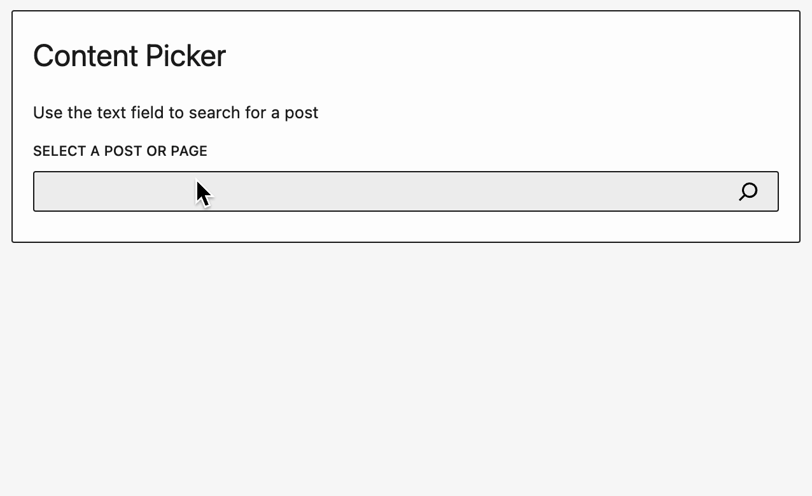

# ContentPicker

A Content Picker component that allows you to pick posts and pages very easily.



## Usage

```js
import { ContentPicker } from '@10up/block-components';

function MyComponent( props ) {

    return (
        <ContentPicker
            onPickChange={ (pickedContent) => { console.log(pickedContent) } }
            mode="post"
            label={ "Please select a Post or Page:" }
            contentTypes={ [ 'post', 'page' ] }
        />
    )
}
```

## Props

| Name                 | Type       | Default              | Description                                                                                                                                                                                                                                                                                                                                                                                                            |
|----------------------|------------|----------------------|------------------------------------------------------------------------------------------------------------------------------------------------------------------------------------------------------------------------------------------------------------------------------------------------------------------------------------------------------------------------------------------------------------------------|
| `onPickChange`       | `function` | `undefined`          | Callback function the list of picked content gets changed                                                                                                                                                                                                                                                                                                                                                              |
| `queryFilter`        | `function` | `undefined`          | Function called to allow you to customize the query before is made. It's advisable to use `useCallback` to save this parameter                                                                                                                                                                                                                                                                                         |
| `label`              | `string`   | `''`                 | Renders a label for the Search Field.                                                                                                                                                                                                                                                                                                                                                                                  |
| `mode`               | `string`   | `'post'`             | One of: `post`, `user`, `term`                                                                                                                                                                                                                                                                                                                                                                                         |
| `placeholder`        | `string`   | `''`                 | Renders placeholder text inside the Search Field.                                                                                                                                                                                                                                                                                                                                                                      |
| `contentTypes`       | `array`    | `[ 'post', 'page' ]` | Names of the post types or taxonomies that should get searched                                                                                                                                                                                                                                                                                                                                                         |
| `maxContentItems`    | `number`   | `1`                  | Max number of items a user can select.                                                                                                                                                                                                                                                                                                                                                                                 |
| `isOrderable`        | `bool`     | `false`              | When true, will allow the user to order items. Must be used in conjunction with `maxContentItems > 1`                                                                                                                                                                                                                                                                                                                  |
| `uniqueContentItems` | `bool`     | `true`               | Prevent duplicate items from being picked.                                                                                                                                                                                                                                                                                                                                                                             |
| `excludeCurrentPost` | `bool`     | `true`               | Don't allow user to pick the current post. Only applicable on the editor screen.                                                                                                                                                                                                                                                                                                                                       |
| `content`            | `array`    | `[]`                 | Array of items to pre-populate picker with. Must be in the format of: `[{id: 1, type: 'post', uuid: '...',}, {id: 1, uuid: '...', type: 'page'},... ]`. You cannot provide terms and posts to the same picker. `uuid` was added as of version 1.5.0. It is only used as the React component list key in the admin. If it is not included, `id` will be used which will cause errors if you select the same post twice. |
| `perPage`            | `number`   | `50`                 | Number of items to show during search                                                                                                                                                                                                                                                                                                                                                                                  |
| `fetchInitialResults` | `bool`     | `false`               | Fetch initial results to present when focusing the search input                                                                                          |                                                                                                                                                                                                                                                           |
| `pickedOrder`        | `string|function`   | `start`              | Where new selected items should be placed within the selected content list. `start` pushes the new item at begining of the list while `end` pushes it to be the last. For more control pass a function to be called with two arguments `(selectedItem, currentContent) => {}`. |

__NOTE:__ Content picker cannot validate that posts you pass it via `content` prop actually exist. If a post does not exist, it will not render as one of the picked items but will still be passed back as picked items if new items are picked/sorted. Therefore, on save you need to validate that all the picked posts/terms actually exist.

The `contentTypes` will get used in a Rest Request to the `search` endpoint as the `subtypes`:

```js
apiFetch( {
    path: `wp/v2/search/?search="${keyword}"&subtype="${contentTypes.join(',')}"&type=${mode}`
} )...
```
