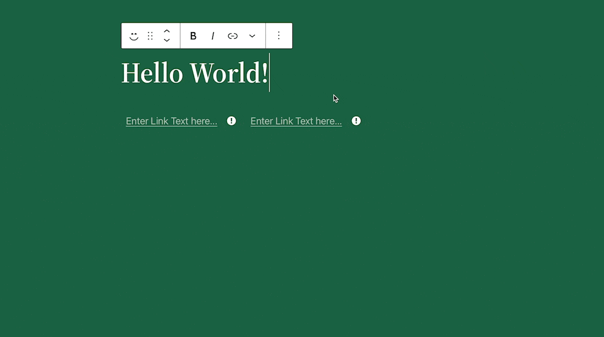

# Link



The `<Link>` Component makes it super simple to add inline links to your custom blocks.

## Usage

```js
import { Link } from '@10up/block-components';

const BlockEdit = (props) => {
    const { attributes, setAttributes } = props;
    const { linkText, linkUrl, opensInNewTab } = attributes;

    const blockProps = useBlockProps();

    const handleTextChange = value => setAttributes({text: value});
    const handleLinkChange = value => setAttributes({
        linkUrl: value?.url,
        opensInNewTab: value?.opensInNewTab,
        linkText: value?.title ?? linkText
    });
    const handleLinkRemove = () => setAttributes({
        linkUrl: null,
        opensInNewTab: null,
    });

    return (
        <div {...blockProps}>
            <Link 
                value={ linkText }
                url={ linkUrl }
                opensInNewTab={ opensInNewTab }
                onTextChange={ handleTextChange }
                onLinkChange={ handleLinkChange }
                onLinkRemove={ handleLinkRemove }
                className='example-classname'
                placeholder='Enter Link Text here...'
            />
        </div>
    )
}
```

The `<RichText>` node will only render when BlockEdit is selected.

## Props

| Name       | Type              | Default  |  Description                                                   |
| ---------- | ----------------- | -------- | -------------------------------------------------------------- |
|  `value` | `string` | `undefined` |        The text to show inside the link |
|  `type` | `string` | `""` |        Post or Page, used to autosuggest content for URL |
|  `opensInNewTab` | `boolean` | `false` |     Should the link open in a new tab? |
|  `url` | `string` | `undefined` |        The actual link to be set as href |
|  `onLinkChange` | `Function` | `() => {}` |     Callback when the URL is changed |
|  `onLinkRemove` | `Function` | `null` |     Optional Callback when the URL is removed. The "Unlink" option only gets shown if this prop gets provided |
|  `onTextChange` | `Function` | `() => {}` |     Callback when the link's text is changed |
|  `kind` | `string` | `""` |        Page or Post |
|  `placeholder` | `string` | `Link text ...` |      Text visible before actual value is inserted |
|  `className` | `string` | `undefined` |          html class to be applied to the anchor element |
