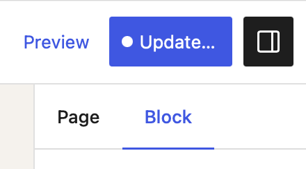

# `PostContext`

The `PostContext` component allows you to customize the post object referenced by any of the components referencing the current post object. They are all prefixed with `Post`.

For example this can be used to build a custom block that gets used inside the core query loop and accesses the passed in post id / post type of that to power the functionality of all the `Post` child components.

## Usage

```js
import { PostContext, PostTitle } from '@10up/block-components';

function BlockEdit() {

    return (
        <PostContext postId={42} postType={'page'} isEditable={true} >
            <PostTitle tagName="h2" className="wp-block-example-hero__title" />
        </PostContext>
    )
}
```

The `PostContext` component works great with the Core Query Loop block if you want / need to create a custom block to be used within the post template. Any block that gets used inside the query loop can access the current post id, post type, and query id via the block context. A block only needs to set the [`usesContext` property in the `block.json`](https://developer.wordpress.org/block-editor/reference-guides/block-api/block-metadata/#context) file to `[ "postId", "postType" ]`. These values can then be accessed via the `context` property passed into the block via the `props` and then used within the `<PostContext>` to make them available for any of the post level components nested within.

```js
import { PostContext, PostTitle } from '@10up/block-components';

function BlockEdit(props) {
    const { context } = props;
    const { postId, postType, queryId } = context;
    const isDescendantOfQueryLoop = Number.isFinite(queryId);

    return (
        <PostContext postId={postId} postType={postType} isEditable={!isDescendantOfQueryLoop}>
            <PostTitle tagName="h2" className="wp-block-example-hero__title" />
        </PostContext>
    )
}
```

*Note: If you enable `isEditable` prop in the `<PostContext>` component for posts that aren't the current post this will create updates the external post. These updates only get applied when the user clicks on the "Save" button at which point they will get shown a list of the different posts they are updating.

This should be used with caution since it may not be immediately obvious for users.*



## Props

| Name       | Type              | Default  |  Description                                                   |
| ---------- | ----------------- | -------- | -------------------------------------------------------------- |
| `postId` | `number` | `null` | ID of the post |
| `postType` | `string` | `null` | post type of the post |
| `isEditable` | `boolean` | `null` | whether the post is editable. Controls the behavior of the nested `Post` components |
| `children` | `node` | `null` | any child components |
